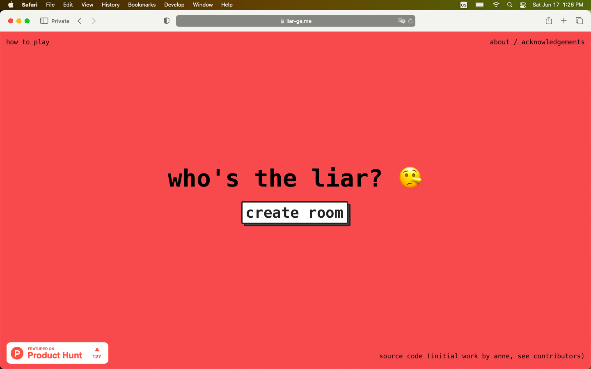
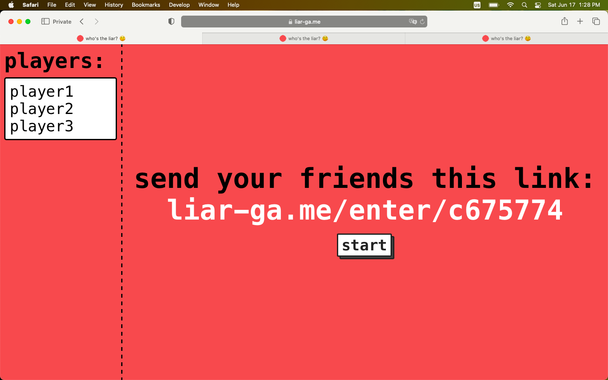
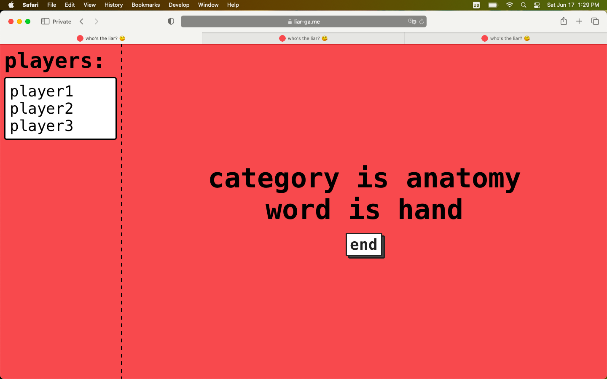
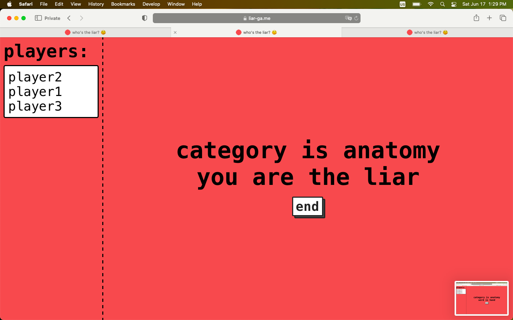
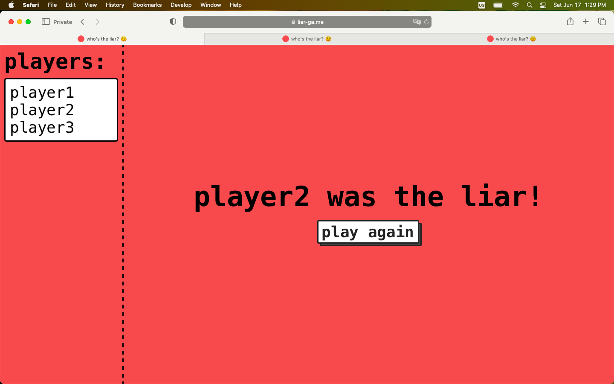
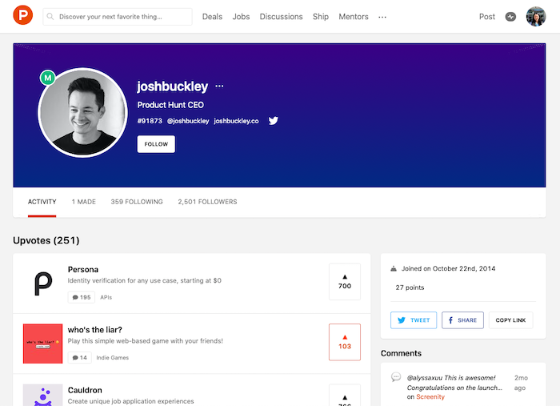

# who's the liar? 🤥
### Firebase, React
#### Update: life has gotten busy and I no longer have the bandwidth to maintain this project, so it's no longer accepting contributions (and the web app is no longer up). Thanks to everyone who contributed while it was active, and feel free to fork it and make it your own :) Thanks also to everyone who played (the more than 10K games!) — I hope it was a source of fun.
Play this simple web-based game with your friends!

What it looked like:

### About & Acknowledgements
I didn't invent this game! I decided to make this after seeing a [video](https://youtu.be/5MS3iaNmKQE?t=401) of a Kpop group playing it. It's built with [Firebase](https://firebase.google.com/docs) and [React](https://create-react-app.dev) (I wasn't super familiar, so I followed a [few](https://css-tricks.com/intro-firebase-react/) [really](https://www.developintelligence.com/blog/2017/04/building-a-realtime-chess-game-with-react-and-firebase/) [nice](https://medium.com/@hasangi/writing-deleting-and-updating-data-in-firebase-realtime-database-with-javascript-f26113ec8c93) [tutorials](https://css-tricks.com/building-a-real-time-chat-app-with-react-and-firebase/)). Styling for buttons was done using [thesephist](https://github.com/thesephist)'s [blocks.css](https://github.com/thesephist/blocks.css), and game IDs were generated with [node-randomstring](https://www.npmjs.com/package/randomstring). Usernames are the only player-specific data stored in the database. I did not enable Firebase's Google Analytics for this project.

### Usage
You can visit [liar-ga.me](https://liar-ga.me) to play. Instructions are [here](https://liar-ga.me/instructions). (Would recommend playing over video call with friends)

### Contributing
As I mentioned, I don't have a ton of experience building Firebase-React apps, so I'm not sure if everything I did was most efficient / best practice / most secure. Also, there are a lot of different scenarios this app doesn't handle gracefully (e.g. joining / leaving mid-game), and the current set of categories / words is quite limited. If you see anything you want to improve, feel free to report a bug in the Issues section or make a PR! (Note: in order to test locally, you'll need to set up a Firebase project, create a file named 'firebase.js' in the src directory, and fill it in as follows:

`import firebase from 'firebase'`

`var firebaseConfig = { ... };` (copy-paste, provided by Firebase upon setup)

`firebase.initializeApp(firebaseConfig);`

`export default firebase;`

To add categories and words, follow the pattern in the Room.js file. Please do not add harmful or offensive words; those will be removed.

**tldr &#8212; this project is open to contributions and feedback :)**

